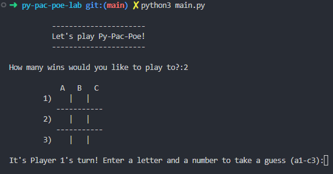
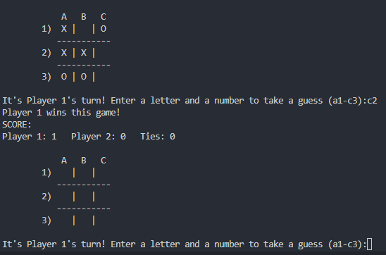
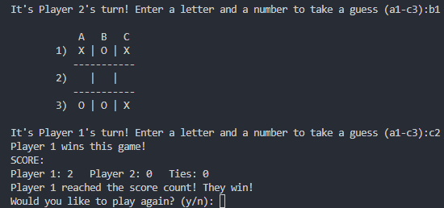

# <h1 align="center">Py-Pac-Poe</h1>

  
 

## 📝Description
This is a console game of Tic-Tac-Toe created in Python.  As part of a bonus project for the General Assembly: Software Immersive program, I completed this project in a two hour timeframe.

## 🖼️ Screenshots

 
 📊 Gameplay

 
 | Description | Screenshot |
 |------------ | ------------|
 | <h3 align="center">Game Start</h3> | 
 | <h3 align="center">Single Win</h3> | 
 | <h3 align="center">Overall Win</h3> | 
 

## 💻 Technologies Used

## ⚛️ Getting Started
### 📲 Instructions

How to Play the Game

1. Run the command 'python3 main.py'.

2. Enter a number of games you and a player would like to play.
 
3. Place your boats using the rules in the top-left of the screen.

4. Alternate turns by making a move in a 3 x 3 grid (A1-C3).

5. Continue play until a player wins the entered number of games.

# Next Steps

- [ ] None! This project was done to showcase the quality of the code I can write within a given time frame.
- [ ] Known bugs:
    - The tie count does not increment in the scoreboard after each game
    - The user can type anything they want into the prompts for a move (ie A1 = true, D7 = false and throws error)